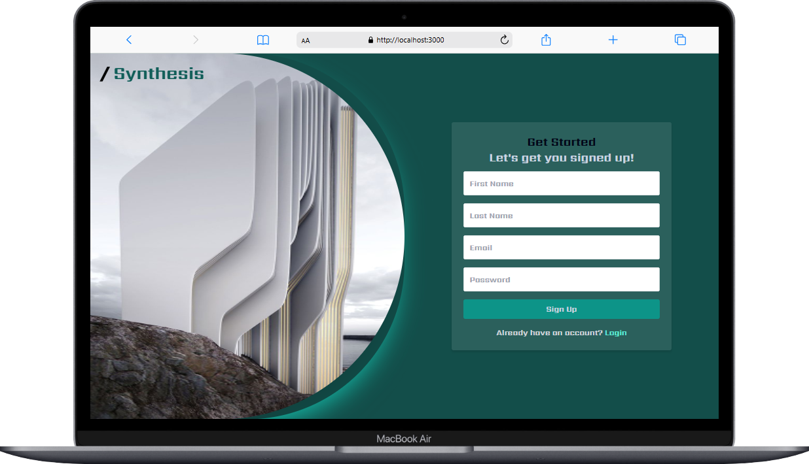

# Synthesis

## Synthesis is a cutting-edge generative AI application that combines text-based conversational capabilities with an innovative voice feature. Users can interact with the app by speaking, and it processes the speech input to generate intelligent responses. Think of it as ChatGPT, but with voice functionality!

## Features
### Voice Input: Speak directly to the app for a more interactive experience.
### Text Input: Type your requests or prompts if preferred.
### AI Responses: Generate coherent and valid responses to your queries or prompts.
### Conversation History: View a log of your interactions for reference.
### User Authentication: Secure signup and login system.
## Tech Stack
### Synthesis was built using the following technologies:

### Frontend: Next.js (React) with TypeScript, Redux, and Tailwind CSS for styling.
## Backend: Node.js.
### Additional Tools: Toastify for notifications.
## Getting Started
### Prerequisites
### Make sure you have the following installed:

#### Node.js: Version 14.x or higher.
#### npm: Node package manager.
### Installation
#### Clone the repository:
#### git clone [Github Repo](https://github.com/Aesthetic-Dee/Synthesis-AI.git)

#### cd Synthesis-AI
#### npm install
#### npm run dev
#### Open the app in your browser at http://localhost:3000.
## License
### This project is open source and available under the MIT License.

## Acknowledgments
### Special thanks to @dchief1 on GitHub for assistance with the backend development.

## Screenshots
### Here are screenshots of the Synthesis app in action:

#### Signup Page: 

#### Dashboard View: .png)

## Repository
### Find the full codebase and contribute at the official GitHub repo:
#### Synthesis-AI GitHub Repository
